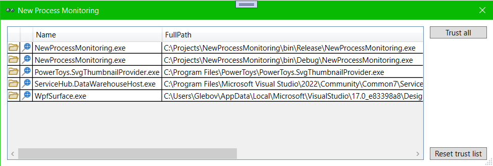

# NewProcessMonitoring
Monitoring tool for finding new processes and runned applications in system.
This is help to watch for new application in windows.

This window show all processes what you not added to `Trusted`
Click `Trust All` if this list is OK. This processes will be added to ignore list.
Click `Reset trust list` if you want to see agan full list

## Create setup
1) Open `NSIS_SetupFile.nsi` in NSIS Compiler
2) Click `Compile`
3) Get NewPMSetup.exe from project folder
